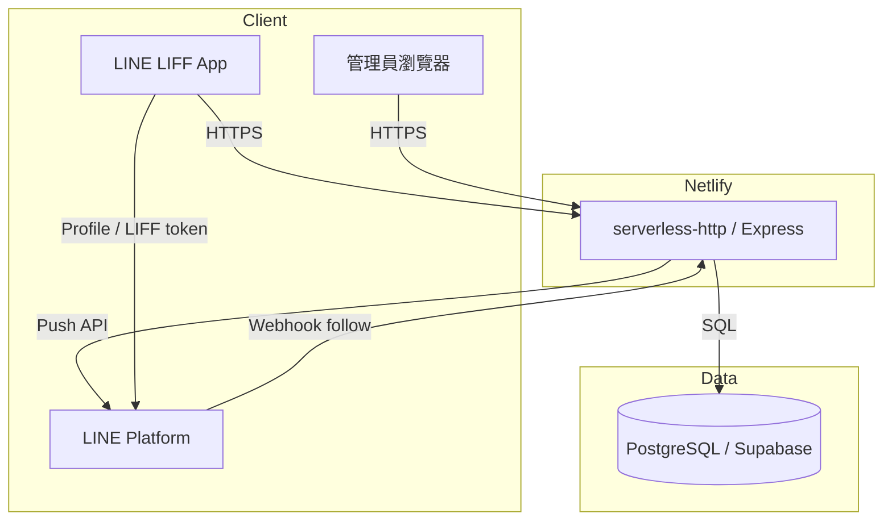

# LINE MGM Lucky Straw — 專案交接說明（給重開發用）

> 本文件描述**現有程式庫**的業務目標、架構、資料模型、流程與限制，供另一個 AI 或工程師接手重構／重開發。  
> 最後整理依據：repo 內 `src/`、`views/`、`scripts/`、`.env.example`（2026-05）。

---

## 1. 專案是什麼

**OpenRice「春日野餐祭」LINE 官方帳號刮刮樂活動（MGM 邀請加碼）**

- 使用者在 **LINE LIFF** 內登入 → 刮刮樂抽獎 → 中獎後以 **LINE Push** 通知。
- 使用者可分享 **專屬邀請連結**；好友透過連結綁定後，若**尚未加入** OpenRice LINE@ 並完成 **follow**，邀請人可獲 **加碼刮刮樂次數**。
- **管理後台**（密碼登入）管理獎品庫存、活動時間、報表、邀請未完成名單推播、手動補次數等。

| 項目 | 說明 |
|------|------|
| Repo 名稱 | `line-mgm-lucky-straw` |
| 執行入口 | `server.js` → `src/app.js` |
| 正式部署（已知） | Netlify：`line-mgm-luckystraw.netlify.app` |
| GitHub（已知） | `Harveylin0316/LINE-MGM-lucky-straw` |
| 資料庫 | **PostgreSQL**（Supabase 等；連線字串 `DATABASE_URL`） |
| 歷史 | 曾用 SQLite，有 `scripts/migrate-sqlite-to-postgres.js`；**網頁版抽獎已關閉**，僅 LIFF |

---

## 2. 技術棧

| 層級 | 技術 |
|------|------|
| Runtime | Node.js 18+ |
| Web | Express 4、EJS 模板 |
| DB | `pg`（連線池） |
| 認證 | JWT 存在 `httpOnly` cookie `auth_token`（7 天） |
| 安全 | `helmet`、登入 rate limit、管理員登入 IP 節流 |
| LINE | LIFF SDK（前端）、Messaging API **push**、Webhook **follow** |
| 部署 | Netlify Functions + `serverless-http`（`netlify/functions/server.js`） |
| 靜態資源 | `public/`（含推播用圖 `picnic-basket-*.png` 等） |

**依賴重點**（見 `package.json`）：`express`, `ejs`, `pg`, `jsonwebtoken`, `bcryptjs`, `multer`, `serverless-http`；`sqlite3` 僅遷移腳本使用。

---

## 3. 目錄結構

```
server.js                 # 本機 listen；export app
netlify/
  functions/server.js     # serverless 包裝
  toml                    # 全站 redirect 到 function
src/
  app.js                  # Express 組裝、env、pool、掛路由
  core/                   # 業務核心（無 HTTP）
    auth.js               # JWT cookie
    lottery.js            # 依 quantity 加權抽獎
    dbInit.js               # DDL、RLS policy、建 admin
    inviteReward.js         # follow 後發加碼（交易）
    inviteRewardPushMessages.js
    linePush.js             # LINE push + line_push_logs
    linePushImageResolve.js # 解析 HTTPS 圖片 URL
    lineFlexMessage.js
    lineUserId.js           # Uxxxxxxxx 正規化
    liffPermalink.js        # liff.line.me 永久連結
    campaignWindow.js       # 活動開始/結束判斷
    viewState.js            # 獎品快取、抽獎結果 cookie
    adminLoginThrottle.js
    inviteBonusConfig.js
  routes/
    liff.js                 # LIFF 使用者流程（主戰場）
    web.js                  # 管理後台 + 公開媒體
    lineWebhook.js          # POST /webhooks/line
views/                    # EJS 頁面
public/                   # CSS、圖片、預設 Flex JSON
scripts/                  # 遷移、補發、demo push
.env.example              # 環境變數範本
```

---

## 4. 系統架構（高層）



---

## 5. 業務規則（必讀）

### 5.1 使用者與次數

| 欄位 | 說明 |
|------|------|
| `users.draws_left` | 可刮次數；LIFF 新用戶註冊預設 **1** |
| `users.extra_draws` | 邀請加碼累計（邏輯上 cap 為 **1**，見下） |
| `users.line_user_id` | LINE Messaging User ID（`U` + 32 hex） |
| `users.invite_code` | 4 位邀請碼，用於 `/liff/{code}` |

**刮獎扣次**：每次 `POST /liff/lottery/draw` 成功扣 `draws_left` 1，並從 `prizes` 庫存抽一項（`quantity` 加權）。

**目前實作**：每次成功刮獎都 `INSERT draw_logs` 且 `is_win = true`（有庫存即「中獎」某獎品名稱）。

### 5.2 獎品

- 獎品在 `prizes` 表：`name`, `quantity`。
- 抽獎演算法：`src/core/lottery.js` → `pickPrizeByQuantity`（依剩餘 `quantity` 加權隨機）。
- 名稱含 `test`（不分大小寫開頭）的獎品會被排除且不參與抽獎。
- 前台展示獎項範例（`views/lottery.ejs`，實際 DB 名稱由後台維護）：
  - 20,000 亞洲萬里通里數
  - **Rice Dollars $100**
  - **Rice Dollars $30**
  - 10,000 里數（早鳥）等

### 5.3 活動時間

- `campaign_settings` 單列 `id=1`：`starts_at`, `ends_at`（`TIMESTAMPTZ`）。
- 後台以**台北時間** `datetime-local` 輸入；`getCampaignPhase()` → `not_started` | `active` | `ended`。
- 非 `active` 時 LIFF 抽獎會拒絕並顯示訊息。

### 5.4 邀請加碼（MGM）

1. 邀請人分享 `https://liff.line.me/{LIFF_ID}/xxxx`（`xxxx` = `invite_code`）。
2. 好友開連結、LIFF 登入 → `bindInviteIntent` 寫入 `line_invites`（`status=pending`），以 **`invitee_line_user_id`** 為 UNIQUE。
3. 好友點「加 OpenRice LINE@」→ 官方帳 **follow** → Webhook `POST /webhooks/line`。
4. `applyInviteFollowReward`：
   - 找到該 `invitee_line_user_id` 的 pending 邀請；
   - 邀請人 `extra_draws` 已達 cap → `line_invites.status = capped`；
   - 否則依「已完成任務的好友數」計算是否發加碼：每 **`LIFF_INVITE_FRIENDS_PER_DRAW`**（預設 2）人發 1 次；
   - **每人最多 1 次加碼**：`effectiveInviteBonusCap` 把 `LIFF_INVITE_BONUS_MAX` 與 1 取 min（程式內硬上限 1）。
5. 發獎時：`draws_left += grantDraws`，`extra_draws` 更新，`line_invites.status = rewarded`。
6. 背景 **LINE Push** 給邀請人（進度圖 002 / 加碼成功圖 `invite-bonus-granted.png`）。

**重要**：好友必須**先**走邀請連結綁定，**再** follow；否則 Webhook 會 `no_matching_invite`。

### 5.5 LINE 推播（中獎）

刮獎成功後非同步 `push`：

1. 文字：中獎獎品名；
2. 可選第二則：剩餘刮次 / 邀請加碼說明 + LIFF 連結；
3. **僅第 1 次累計刮獎** 可附圖 `picnic-basket-001.png`（需可公開 HTTPS 的 `LINE_PUSH_PUBLIC_BASE_URL` 等）。

推播紀錄寫入 `line_push_logs`。

### 5.6 已關閉的舊功能

以下路由回 **404**（引導使用 LINE）：

- `/login`, `/register`, `/lottery`, `/my-draws` 等網頁版會員抽獎。

---

## 6. HTTP 路由一覽

### 6.1 LIFF（使用者）— `src/routes/liff.js`

| 方法 | 路徑 | 說明 |
|------|------|------|
| GET | `/liff` | 導向 lottery |
| GET | `/liff/login` | LIFF 登入頁 |
| POST | `/liff/auth` | 用 LIFF access token 換 JWT |
| POST | `/liff/logout` | 清除 cookie |
| GET | `/liff/lottery` | 刮刮樂主頁（需登入） |
| POST | `/liff/lottery/draw` | 執行抽獎（交易） |
| GET | `/liff/:refUserId` | 邀請落地（4 碼或舊格式） |
| GET | `/liff/r/:refUserId` | 邀請落地（相容舊連結） |

### 6.2 LINE Webhook — `src/app.js`

| 方法 | 路徑 | 說明 |
|------|------|------|
| POST | `/webhooks/line` | 驗簽 HMAC；僅處理 `follow` |

### 6.3 管理後台 — `src/routes/web.js`

登入路徑由 **`ADMIN_LOGIN_PATH`** 決定（非預設 `/admin/login`，該路徑故意 404）。

| 路徑 | 功能 |
|------|------|
| `GET/POST` `{ADMIN_LOGIN_PATH}` | 管理員登入 |
| `POST /logout` | 登出 |
| `/admin/prizes` | 獎品 CRUD、命中率顯示 |
| `/admin/prizes/logs` | 獎品變更紀錄 |
| `/admin/campaign` | 活動起訖時間 |
| `/admin/reports` | 成效報表、用戶列表、**刮獎明細分頁**、可疑刷量 |
| `/admin/users/bonus` | 手動補刮次／加碼 |
| `/admin/users/bonus/logs` | 手動補次稽核 |
| `/admin/invite-reminders` | 邀請未完成名單、Flex 推播設定、批次 push |
| `/admin/line/webhooks` | Webhook 事件 log |
| `GET /p/line-media/:id` | 後台上傳圖片給 LINE 抓（存在 DB `line_push_media`） |

根路徑 `/`：已登入管理員 → `/admin/prizes`；否則 404。

---

## 7. 資料庫 Schema

啟動時 `initDb()` 會 `CREATE TABLE IF NOT EXISTS` 並對多表 **ENABLE ROW LEVEL SECURITY**，再建立 policy `app_server_full_access` 給 `postgres` / `service_role`（防 Supabase PostgREST 裸奔）。

### 7.1 核心表

**users**

| 欄位 | 說明 |
|------|------|
| id | SERIAL PK |
| username | UNIQUE |
| password_hash | bcrypt |
| draws_left, extra_draws | 次數 |
| referrer_id | 舊版邀請（網頁註冊，現少用） |
| is_admin | 管理員 |
| line_user_id, line_display_name, line_picture_url | LINE 資料 |
| invite_code | 4 字邀請碼 |

**prizes** — `id`, `name`, `quantity`, `created_at`

**draw_logs** — `user_id`, `is_win`, `prize_name`, `message`, `created_at`

**prize_change_logs** — 後台改獎品稽核

**line_invites** — `inviter_user_id`, `invitee_line_user_id` UNIQUE, `status`（pending/rewarded/capped/invalid）, `followed_at`, `rewarded_at`

**line_webhook_events** — Webhook 每事件一筆，含 `result`, `detail`, `raw_event` JSONB

**line_push_logs** — 每次 push 嘗試、status、payload

**campaign_settings** — 單列 id=1 活動時間

**admin_login_throttle** — 登入失敗 IP 紀錄

**line_push_media** — UUID → 圖片 binary（PNG/JPEG）

**admin_push_settings** — slug=`invite_reminder` 文案、圖、Flex JSON

**admin_manual_bonus_logs** — 手動補次稽核

### 7.2 實用查詢範例

**Rice Dollars $30 / $100 中獎者（含 LINE ID，供受眾上傳）**

```sql
SELECT DISTINCT
  u.line_user_id,
  u.line_display_name,
  u.username,
  d.prize_name,
  d.created_at
FROM draw_logs d
JOIN users u ON u.id = d.user_id
WHERE d.is_win = true
  AND u.line_user_id IS NOT NULL
  AND BTRIM(u.line_user_id) <> ''
  AND (
    d.prize_name ILIKE '%Rice Dollars%30%'
    OR d.prize_name ILIKE '%Rice Dollars%100%'
  )
ORDER BY d.prize_name, d.created_at;
```

---

## 8. 環境變數

完整範本見 **`.env.example`**。生產環境**必填**：

| 變數 | 用途 |
|------|------|
| `DATABASE_URL` | Postgres |
| `JWT_SECRET` | ≥32 字元 |
| `ADMIN_PASSWORD` | 首次建 admin（≥8 字） |
| `LIFF_ID` | LIFF 永久連結 |
| `LINE_CHANNEL_SECRET` | Webhook 驗簽 |
| `LINE_CHANNEL_ACCESS_TOKEN` | Push |
| `LINE_OFFICIAL_ADD_FRIEND_URL` | 完整 `https://line.me/...` |
| `ADMIN_LOGIN_PATH` | 隱藏登入路徑（建議長隨機） |

**常用選填**

| 變數 | 用途 |
|------|------|
| `SKIP_DB_DDL_ON_BOOT=1` | Netlify 冷啟動略過完整 DDL |
| `LIFF_INVITE_BONUS_MAX` | 預設 1（程式 cap 仍 ≤1） |
| `LIFF_INVITE_FRIENDS_PER_DRAW` | 每幾人 follow 發 1 加碼（預設 2） |
| `LIFF_ENDPOINT_IS_SITE_ROOT=1` | LIFF Endpoint 為網站根目錄時 |
| `LINE_PUSH_PUBLIC_BASE_URL` / `URL` | LINE 抓圖用 HTTPS 主網域 |
| `LIFF_REDEMPTION_NOTE` | 兌換說明文案 |
| `LIFF_CAMPAIGN_PAGE_URL` | 活動辦法連結 |

**勿提交**：`.env`、`.env.migrate`（含 DB 密碼）。遷移用 `.env.migrate.example`。

---

## 9. 部署與維運

### 9.1 Netlify

- `netlify.toml`：`publish = public`，其餘 `/*` → `/.netlify/functions/server`。
- Function 需 bundle `views/**`, `public/**`。
- 平台注入 `URL` 可作推播圖片 base。

### 9.2 本機

```bash
npm ci
cp .env.example .env   # 填入變數
npm start              # http://localhost:3000
```

### 9.3 腳本

| 腳本 | 用途 |
|------|------|
| `scripts/migrate-sqlite-to-postgres.js` | SQLite → Postgres |
| `scripts/migrate-supabase.sh` | 舊 Supabase → 新 Supabase dump/restore |
| `scripts/backfill-invite-rewards.js` | 補發邀請 follow 獎勵 |
| `scripts/send-invite-bonus-demo-push.js` | 測試邀請加碼推播文案 |
| `scripts/upsert-admin.js` | 建立/更新管理員 |
| `scripts/resequence-prizes.js` | SQLite 時重排 prize id（舊） |

---

## 10. 認證與安全

- **LIFF 使用者**：`POST /liff/auth` 用 LIFF access token 向 `https://api.line.me/v2/profile` 取 profile → upsert `users` → 發 JWT cookie。
- **管理員**：僅 `users.is_admin = true` 可進 `/admin/*`；登入路徑可隱藏。
- **Webhook**：`x-line-signature` HMAC-SHA256，body 須為 raw JSON（`express.raw` 僅掛在 webhook 路由前）。
- **Rate limit**：`/liff/auth`、管理員登入 POST 等。
- **RLS**：表層對 anon 無 policy；應用程式用 `DATABASE_URL`（postgres/service_role）連線。

---

## 11. 現有能力 vs 未實作（重開發缺口）

### 已有

- LIFF 登入、刮獎、庫存加權、活動時間窗
- 邀請綁定 + follow Webhook 加碼 + 推播
- 管理後台（獎品、報表、Webhook log、邀請提醒批次 push、手動補次）
- 中獎 / 邀請相關 **單人 Push**
- 後台「刮刮樂／中獎明細」分頁查詢

### 沒有（常見需求）

| 需求 | 現況 |
|------|------|
| LINE **受眾 / 標籤** 同步 | 無；需手動匯出 `line_user_id` 至 OA 後台 UID 受眾 |
| **Multicast / Narrowcast** 群發 | 無 |
| 未中獎紀錄 | 現流程每次刮都寫 `is_win=true` |
| 網頁版使用者抽獎 | 已關閉 |
| 獎品自動兌換 / 第三方 API | 無 |
| Rice Dollar 中獎者一鍵 CSV 匯出 | 無專用按鈕（需 SQL 或報表手動篩） |
| 單元測試 / E2E | 無 |

---

## 12. 重開發建議（給下一個 AI）

1. **先釐清產品邊界**：是否保留「每次必中某一庫存獎」還是改為機率 + 銘謝惠顧；影響 `draw_logs` 與庫存邏輯。
2. **保留 `line_user_id` + `draw_logs` + `line_invites`** 三表關係；邀請與 Webhook 是最高複雜度區。
3. **交易邊界**：抽獎、`applyInviteFollowReward` 已在 transaction；重構時勿拆散 FOR UPDATE 順序。
4. **LIFF 連結**：統一用 `buildLiffPermalink` + `invite_code`；注意 `LIFF_ENDPOINT_IS_SITE_ROOT`。
5. **Serverless**：冷啟動、`SKIP_DB_DDL_ON_BOOT`、小連線池 `PG_POOL_MAX=2`。
6. **若要做 LINE 分眾**：新增 Audience API 或後台 CSV 匯出端點，不要只靠手動 SQL。
7. **觀測性**：已有 `line_webhook_events`、`line_push_logs`；可接 structured logging / Sentry。

---

## 13. 關鍵檔案索引（實作入口）

| 主題 | 檔案 |
|------|------|
| App 組裝、env | `src/app.js` |
| LIFF 登入/抽獎/邀請 | `src/routes/liff.js` |
| 管理後台 | `src/routes/web.js` |
| Webhook | `src/routes/lineWebhook.js` |
| 邀請發獎邏輯 | `src/core/inviteReward.js` |
| 抽獎演算法 | `src/core/lottery.js` |
| DB 初始化 | `src/core/dbInit.js` |
| LINE Push | `src/core/linePush.js` |
| LIFF 主畫面 | `views/liff_lottery.ejs` |
| 報表 | `views/admin_reports.ejs` |

---

## 14. 常見問題（維運）

| 現象 | 可能原因 |
|------|----------|
| Webhook `no_matching_invite` | 好友未先開邀請連結；或 `DATABASE_URL` 與後台看的 DB 不一致 |
| 推播無圖 | 未設 `LINE_PUSH_PUBLIC_BASE_URL` / Netlify `URL`；或圖片 URL 非 HTTPS |
| 加好友連結 404 | `LINE_OFFICIAL_ADD_FRIEND_URL` 設成相對路徑 |
| 管理後台 500 | DB 連線失敗、RLS policy 未建、缺 env |
| 從 Cursor/CI 連 Supabase 逾時 | 執行環境網路封鎖 5432；改在 Supabase SQL Editor 查 |

---

## 15. 相關文件

- 環境變數：`.env.example`
- DB 遷移：`.env.migrate.example`、`scripts/migrate-supabase.sh`
- Git 規則（本 repo）：`.cursor/rules/git-commit-push.mdc`（完成修改後 commit push）

---

*本文件為程式庫現狀摘要，非產品 PRD。重開發時請與業主確認活動規則、獎項名稱與 LINE OA 方案限制。*
